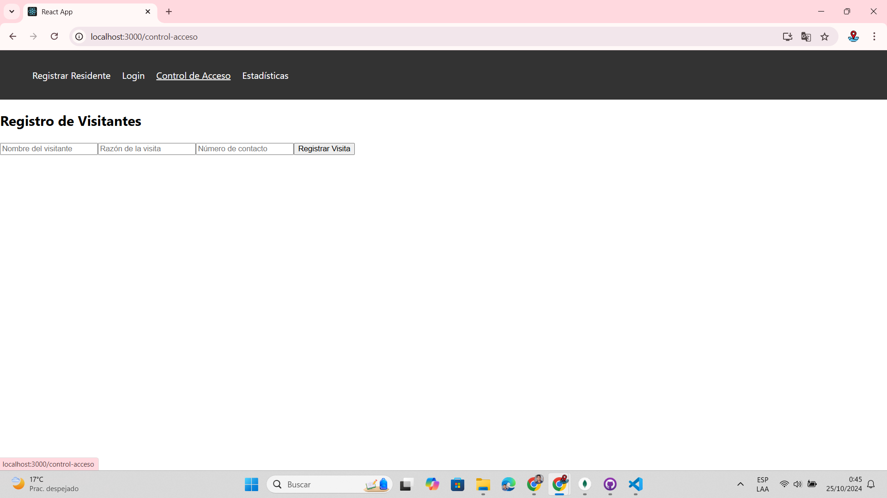

# Control de Acceso a Residentes

Este es un proyecto de aplicación web para gestionar el registro de residentes y el control de acceso de visitantes en una comunidad. Permite registrar residentes, autenticar usuarios, registrar visitantes y visualizar estadísticas de visitas.

## Funcionalidades

### 1. Registro de Residentes
- Formulario para que los residentes ingresen sus detalles, como nombre, número de identificación y placa del vehículo.

### 2. Autenticación
- Sistema de autenticación para garantizar que solo los residentes registrados tengan acceso al sistema.

### 3. Control de Acceso
- Interfaz para que el personal de seguridad registre información de visitantes, como nombre, razón de la visita y número de contacto.

### 4. Estadísticas
- Visualización de estadísticas sobre la frecuencia de visitas y horas pico.

## Tecnologías Utilizadas
- **Frontend**: React.js
- **Backend**: Node.js con Express
- **Base de Datos**: MongoDB
- **Estilo**: CSS

## Instalación

### Requisitos Previos
- Node.js
- MongoDB

### Clonación del Repositorio
```bash
git clone https://github.com/tu-usuario/control-acceso-residentes.git
cd control-acceso-residentes
```
### Navega a la carpeta del backend
```bash
cd backend
npm install
```

### Navega a la carpeta del frontend
```bash
cd ../frontend
npm install
```

## Configuración de la Base de Datos
- Asegúrate de tener MongoDB corriendo en tu máquina local.

## Ejecución del Proyecto

### 1.- Navega a la carpeta del frontend

```bash
cd backend
node server.js
```
### 2.- Iniciar la aplicación frontend:

```bash
cd ../frontend
npm start
```

La aplicación estará disponible en http://localhost:3000 y el servidor backend en http://localhost:5000.

## Vista Previa

### 1. Registro de Residentes:


### 2. Autenticación:


### 3. Control de Acceso:


### 4. Estadísticas:


### 5. Almacenamiento de información en base de datos

### Residentes


### Visitas

